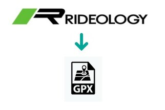
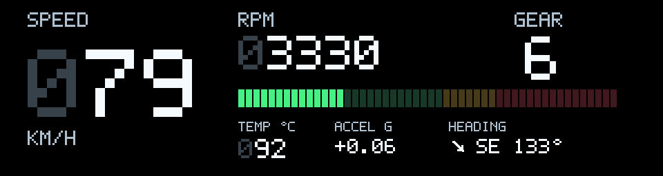

# **$ rideology2gpx**

A simple command line program that convert Kawasaki Rideology `.csv` exports into `.gpx` tracks, `.txt` and `.md` reports, and `.jpg` charts. Optional instrument videos require _FFmpeg_.




## Download

Open the [latest GitHub release](https://github.com/jbokser/rideology2gpx_2.0/releases/latest) and download the archive for your system:

| System | Release archive |
| --- | --- |
| Linux x86-64 | `rideology2gpx-v[VERSION]-x86_64-unknown-linux-gnu.tar.gz` |
| Windows x86-64 | `rideology2gpx-v[VERSION]-x86_64-pc-windows-msvc.zip` |
| macOS Apple Silicon | `rideology2gpx-v[VERSION]-aarch64-apple-darwin.tar.gz` |
| macOS Intel | `rideology2gpx-v[VERSION]-x86_64-apple-darwin.tar.gz` |

Replace `[VERSION]` with the release number shown on GitHub. For beta releases, choose one from [all releases](https://github.com/jbokser/rideology2gpx_2.0/releases). GitHub Releases also provides `SHA256SUMS.txt` to check the downloaded archive.

## Install

Extract the archive and put the executable in a directory on your `PATH`. On Linux and macOS, for example:

```bash
tar -xzf rideology2gpx-v[VERSION]-*.tar.gz
mkdir -p "$HOME/.local/bin"
mv rideology2gpx "$HOME/.local/bin/"
rideology2gpx --version
```

Make sure `$HOME/.local/bin` is on your `PATH`. On macOS, you may instead move the executable to `/usr/local/bin` if that directory is on your `PATH`. If macOS blocks a downloaded executable, review it in **System Settings → Privacy & Security** before allowing it to run.

On Windows, extract the ZIP file, move `rideology2gpx.exe` to a folder of your choice, and add that folder to your user `Path` environment variable. Open a new PowerShell window and check:

```powershell
rideology2gpx --version
```

The program uses system fonts to render JPEG charts. Install a sans-serif font if your system does not have one. Instrument videos also require `ffmpeg` with `libx264` on `PATH`.

## Use

Run the command with a Rideology CSV export:

```bash
rideology2gpx file.csv
rideology2gpx file.csv --trips --offline
rideology2gpx file.csv --output-dir reports
rideology2gpx --help
rideology2gpx --version
```

The importer finds required columns by name, so extra columns, reordered columns, and a different number of metadata lines are accepted. If a required column is absent, the error lists every missing column.

Quote paths containing spaces. By default, outputs are saved beside the CSV. `--output-dir` writes them to another directory and creates it if necessary. The command prints the text report to standard output; the saved `.txt` file contains only the report. It writes Markdown and text reports, one GPX file such as `ride.gpx`, and JPEG charts; `--overlay` also produces an MP4 video. Add `--trips` to split the report and exported files by moving period. Online mode looks up endpoint area names using Nominatim. Use `--offline` to skip location lookups.

## Route maps

Each exported route also gets a map image: `ride-map.jpg` in normal mode or `ride-trip-1-map.jpg`, etc. with `--trips`. It shows the route and start/end markers. In online mode, the background uses OpenStreetMap tiles and the image includes OpenStreetMap attribution. This sends the approximate ride area to the tile server. Only tiles for the requested image and zoom are fetched; requests are sequential and cached for at least seven days in `.rideology-cache/tiles`. Set `RIDEOLOGY_MAP_CACHE` to use another cache directory. `RIDEOLOGY_MAP_TILE_URL` can select an HTTPS OpenStreetMap-compatible tile source with `{z}`, `{x}`, and `{y}` placeholders.

With `--offline`, the map is drawn locally on a plain grid. It does not request or read OpenStreetMap tiles or use Nominatim. If online tiles are unavailable, the program warns and saves this plain map instead.

## Project history and author

This Rust project replaces the original [rideology2gpx Python program](https://github.com/jbokser/rideology2gpx), which is why this repository is named `rideology2gpx_2.0`.

Author: **Juan S. Bokser** ([GitHub](https://github.com/jbokser), [email](mailto:juan.bokser@gmail.com)). This Rust version was made 100% through vibe coding with OpenAI Codex under his direction.

## Build from source

Install Rust and build locally:

```bash
cargo build --release
./target/release/rideology2gpx --version
```

On Windows, use `target\release\rideology2gpx.exe`. On Debian/Ubuntu, building requires `pkg-config`, `libfreetype6-dev`, and `libfontconfig1-dev`; install a sans-serif font such as `fonts-dejavu-core` for rendering.

### GPS jitter correction

GPX coordinates are reconstructed; report statistics and JPGs continue using the original GPS data. The algorithm fits GPS observations and wheel-distance constraints together in a local metric projection. For the interval ending at sample `i`, the target distance is `wheel_speed[i] / 3.6 × actual_elapsed_seconds`. Consecutive samples with zero wheel speed share exactly one position, including their arrival interval, so stopped points do not wander. Their GPS anchor is the median position of the stationary group.

For moving points, 200 bidirectional constraint-fitting passes adjust neighboring positions toward the wheel distance, with a small attraction (2.5% per pass) toward GPS anchors to limit drift. This is a compromise: derived GPS speed approximates wheel speed; it is not guaranteed to match it exactly. Coordinates and start/end locations can move slightly. No map matching is performed, turns can be softened, and the result is not a surveyed or exact original trajectory. If GPS fixes coincide while the wheel indicates motion, a nearby GPS heading is used when available; without any heading information, the exporter does not invent a direction. The local projection is intended for regional rides, not polar or globe-spanning tracks.

Trip boundaries prevent interpolation across missing telemetry. The fitted trajectory does not remove samples or change their times. A viewer that calculates speed from consecutive points should show less jitter, although its own filtering and interpolation may affect the displayed result.

### Instrument video

[](docs/preview.mp4)

[Watch the sample video (MP4)](docs/preview.mp4). The image above links to the same video.

Add `--overlay` to export an H.264 `.mp4` with a black background for each exported route. Without `--trips`, the video is saved beside the GPX and JPG files as `input.mp4`, with `input-preview.jpg` and, for a ride longer than 30 seconds, `input-preview.mp4`. With `--trips`, the files use names such as `input-trip-1.mp4` and `input-trip-1-preview.jpg`. It starts 20 seconds before the highest recorded RPM, shifted as needed to fit within the trip. This requires `ffmpeg` with `libx264` on `PATH`. Existing reports, GPX tracks, and charts are still generated.

```bash
rideology2gpx file.csv --trips --offline --overlay --overlay-fps 60 --overlay-size 1920x512 --redline-rpm 10000
```

The default video is a 1920x512 instrument panel at 30 FPS, ready to position in an editor. `--overlay-fps` accepts 1–120 FPS; `--overlay-size` accepts even dimensions from 480x128 to 3840x2160. The panel is centered if the selected aspect ratio differs from the default. `--redline-rpm` sets the point where the horizontal RPM bar turns red (default 10000). Above it, the significant RPM digits flash between white and orange. `--temp-warning` sets the coolant warning threshold in °C (default 97); above it, significant temperature digits turn yellow. These options also enable video generation without `--overlay`.

Each video starts at its trip's first telemetry sample (video time zero). Frames are placed on the output FPS timeline and speed, RPM, and coolant temperature are linearly interpolated using `elapsed_msec`. Gear changes occur at their recorded timestamps and remain discrete; neutral is green and upshifts and downshifts show a blinking white triangle beside the gear for one second. Speed appears first, gear sits beside RPM, and coolant temperature appears smaller below RPM. Beside it, signed acceleration in g uses wheel-speed changes; its label changes from `ACCEL G` to `BRAKE G` when the value is negative, followed by GPS direction in degrees and eight compass points with a short compass needle to the left of the direction text. The video uses a pixel-style monospace font. Leading zero placeholders are dark gray while significant digits remain white. The RPM bar progresses from green to yellow at 80% of the configured redline, then red at the redline. The last telemetry instant is included; the encoded video duration is rounded up to a whole frame. Align the video's first frame with the trip's first GPX track point or the elapsed range in the `--trips` report. Export progress is printed to stderr for each trip. To place the video over camera footage, use a Screen or Lighten blend mode in your editor; black pixels then contribute no light to the composite. MP4 does not carry an alpha channel.

### Trip charts

A run without `--trips` generates one JPEG chart with speed, RPM, and gear and one speed distribution JPEG for the whole recording. With `--trips`, it generates those charts for each detected trip. The distribution groups GPS distance into 20 km/h speed ranges, using the speed at the end of each recorded interval. Each bar is labeled with its distance in kilometers. Gaps in telemetry contribute no distance.

A JPEG image of the Markdown report is also saved as `ride.export-report.jpg` (using the input stem). It includes the report title, trip sections, and metric and gear tables.

Charts are saved beside the reports and honor `--output-dir` / `-o`. The input stem is preserved (for example, `ride.export.csv` produces `ride.export.jpg` and `ride.export-speed-distribution.jpg` without `--trips`, or `ride.export-trip-1.jpg` and `ride.export-trip-1-speed-distribution.jpg` with it). Trip numbering starts at 1. Files with matching names are replaced on subsequent runs; older files with other trip numbers are not automatically deleted when switching between normal and `--trips` mode or changing detection settings. Use a fresh output directory to see only the files from the current run.

Rendering uses Plotters and system fonts.


In `--trips` mode, a trip starts when wheel speed exceeds `--min-speed` (default: 3 km/h). Samples at or below that threshold count as stopped. A continuous observed stop lasting at least `--stop-seconds` (default: 120) splits trips. Shorter stops remain inside a trip, so ordinary traffic stops need not create new reports. Stop duration is measured from the first stopped sample to the current sample, including a resuming sample when checking the threshold.

With `--trips`, recording gaps longer than 1.5 times the recording's median sampling interval split trips. Without `--trips`, one GPX file is generated with separate track segments across those gaps. A gap means missing data, not confirmed stationary time. Leading and trailing stationary samples are excluded: each trip runs from its first moving sample to its last, including any short stops between them. No acceleration or distance is calculated across trip boundaries. A single moving sample is retained as a zero-duration trip, with unavailable acceleration and braking shown as N/A. In `--trips` mode, an entirely stationary recording produces `No movement detected.`

The movement threshold controls segmentation in `--trips` mode and the samples used for average and median speed in both modes. Total trip time still includes brief stops. There is no minimum trip duration or additional noise filter.

### Endpoint neighborhoods

By default, the CLI sends only the reported start and end coordinates to [Nominatim](https://nominatim.org/), using OpenStreetMap data, and adds an area name beside each coordinate. In `--trips` mode it looks up the endpoints of each trip. No API key is required. Names are requested in Spanish and preserved as returned by the service.


**Public-service limits:** follow the [Nominatim usage policy](https://operations.osmfoundation.org/policies/nominatim/). This integration is for occasional, user-triggered reports, not scheduled or bulk processing. It sends requests sequentially, at least 1.1 seconds apart, identifies the application with a User-Agent, caches results persistently, and credits OpenStreetMap in this README and in `--help`. Processes sharing the same cache also share a request lock and rate limit. Do not run instances with different caches or on multiple machines concurrently against the public service; application-wide traffic must remain below one request per second. Use `--offline` for recordings whose endpoint coordinates should not be sent to the service.

Cache files are stored in `.rideology-cache/` under the current working directory (ignored by Git). They contain queried coordinates and area names, not whole ride traces. Set `RIDEOLOGY_GEOCODE_CACHE` to share a cache across working directories. Cached results do not expire automatically; delete `areas.json` to refresh names. `--offline` skips both cache reads and network lookups. When either endpoint area name is unavailable, the chart title uses the original CSV ride title plus the trip number, such as `Ride title #1 (2026-09-22)`. A custom or self-hosted reverse-geocoding endpoint can be selected with `NOMINATIM_URL` without changing the code.

Location data: © [OpenStreetMap contributors](https://www.openstreetmap.org/copyright), available under the ODbL.

## Publish a version

Run `python3 scripts/prepare_release.py` without arguments to see a suggested next tag. This only prints a suggestion: it does not change files or publish anything. With no existing tag, it suggests the first beta; after a beta it increments the beta number; after a stable release it suggests a patch release. You can choose a different version explicitly.

Use English [Conventional Commit](https://www.conventionalcommits.org/en/v1.0.0/) subjects such as `feat: add a new option` or `fix: correct GPX timing`. The release preparation command collects these subjects since the previous tag into [CHANGELOG.md](CHANGELOG.md), updates `Cargo.toml` and `Cargo.lock`, and runs `cargo check` offline. It requires a clean working tree and Python 3.8 or newer.

```bash
python3 scripts/prepare_release.py 0.1.0-beta.1
git diff                         # review version and changelog
git add Cargo.toml Cargo.lock CHANGELOG.md
git commit -m "chore: prepare v0.1.0-beta.1"
git tag v0.1.0-beta.1
git push origin HEAD
git push origin v0.1.0-beta.1
```

The tag triggers the release workflow. It checks the version, builds four platform archives, verifies `--version` and `-V`, and publishes them with SHA-256 checksums. Tags with a suffix such as `-beta.1` create GitHub prereleases. The preparation command does not publish or push anything, so review the generated changelog before tagging.

## Verification

```bash
cargo test
cargo clippy --all-targets -- -D warnings
```

Errors are printed to stderr and return exit code 1.
