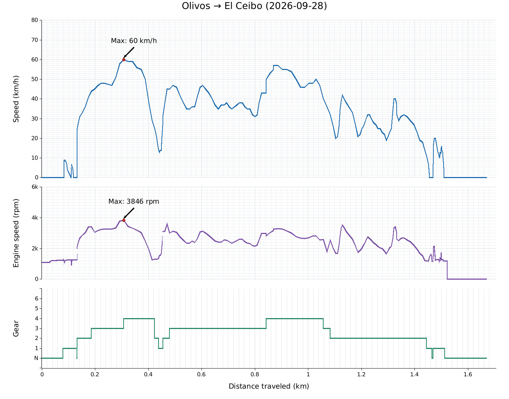
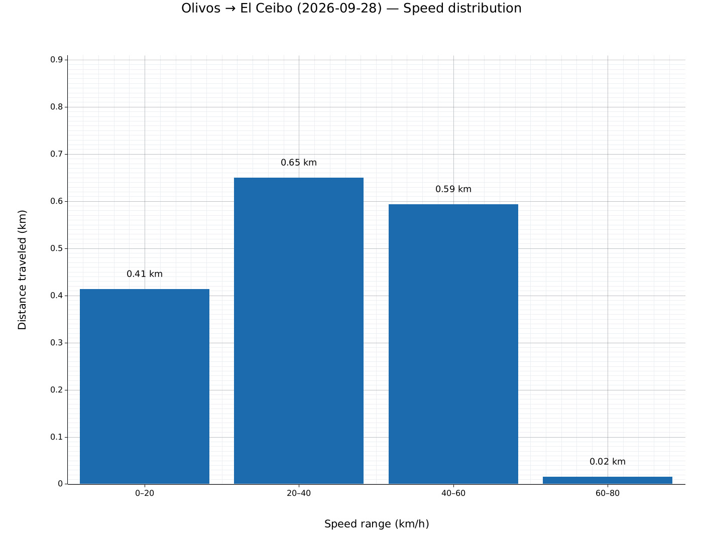
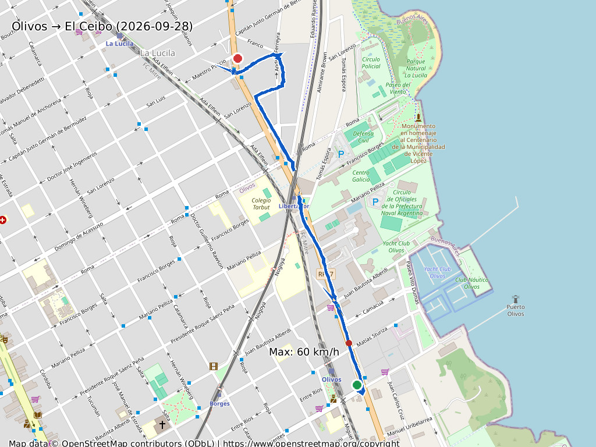
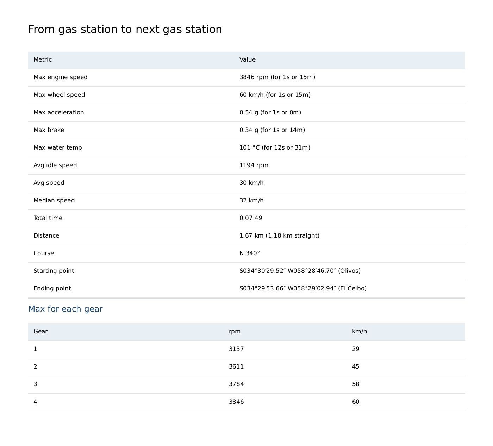

# Example

Run:

```bash
$ rideology2gpx docs/files/ride.csv 
GPX saved to docs/files/ride.gpx
Chart saved to docs/files/ride.jpg
Distribution saved to docs/files/ride-speed-distribution.jpg
Map saved to docs/files/ride-map.jpg
Report image saved to docs/files/ride-report.jpg

From gas station to next gas station
==== === ======= == ==== === =======

Max engine speed: 3846 rpm (for 1s or 15m)
Max wheel speed:  60 km/h (for 1s or 15m)
Max acceleration: 0.54 g (for 1s or 0m)
Max brake:        0.34 g (for 1s or 14m)
Max water temp:   101 °C (for 12s or 31m)
Avg idle speed:   1194 rpm
Avg speed:        30 km/h
Median speed:     32 km/h
Total time:       0:07:49
Distance:         1.67 km (1.18 km straight)
Course:           N 340°
Starting point:   S034°30′29.52″ W058°28′46.70″ (Olivos)
Ending point:     S034°29′53.66″ W058°29′02.94″ (El Ceibo)

Max for each gear
--- --- ---- ----

  Gear    rpm    km/h
     1   3137      29
     2   3611      45
     3   3784      58
     4   3846      60

Reports saved to docs/files/ride.md and docs/files/ride.txt
```

The command prints the text report and writes `.md`, `.txt`, `.gpx`, chart `.jpg`, and route map `.jpg` files.

## Generated images

### Ride chart



### Speed distribution



### Route map



### Report


